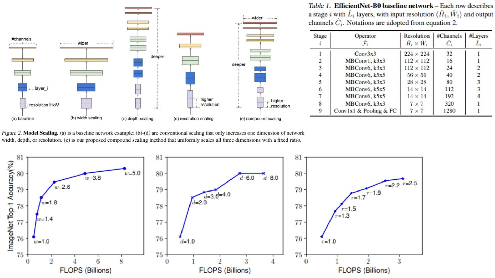

# 🍰 EfficientNet-B0-Replication PyTorch Implementation

This repository contains a replication of **EfficientNet-B0** using PyTorch, following the **compound scaling** and **MBConv** concepts from the original paper. The model is designed for **efficient image classification** while maintaining a good trade-off between **accuracy and FLOPs**.

- Implemented **EfficientNet-B0** with **MBConv blocks**, **depthwise separable convolutions**, and **Squeeze-and-Excitation (SE) layers**.  
- Architecture:  
**Stem → MBConv Stages → Conv1x1 + GlobalAvgPool → Flatten → FC**

> **Note on EfficientNet:** The model uses **compound scaling**, which uniformly scales network **width, depth, and resolution** using fixed coefficients derived from a small grid search on the baseline network.

**Paper reference:** [EfficientNet: Rethinking Model Scaling for Convolutional Neural Networks](https://arxiv.org/abs/1905.11946) ✨

---

## 🖼 Overview – EfficientNet-B0 Architecture



- *Figure 2* shows different scaling strategies: baseline network, width‑only, depth‑only, resolution‑only, and the proposed **compound scaling** (scaling all three together with fixed ratios). 
- *Figure 3* demonstrates the effect of scaling single dimension vs compound scaling — authors observe that scaling only width or only depth or only resolution yields diminishing returns for large models.
- *Table 1* presents the **EfficientNet-B0 baseline** configuration: for each stage it gives operator type (Conv3×3 or MBConv), kernel size, number of channels, number of layers, and feature map resolution. 

> **Why this design matters:**  
> - Using **MBConv blocks + Squeeze‑and‑Excitation (SE)** lets network be efficient but still powerful — good balance of parameters/FLOPs vs performance. 
> - The **compound scaling rule** balances depth, width and resolution so you don’t blow up FLOPs or memory for little accuracy gain.  
> - The baseline B0 architecture (stem → MBConv stages → head + pooling + classifier) is chosen via small‑scale neural‑architecture‑search to optimize efficiency under a FLOPs budget.

---

## 🧮 Mathematical Concepts

### Depthwise Separable Convolution

$$
y = Conv_{1x1}(DWConv_{kxk}(x))
$$

- **x**: input tensor  
- **DWConv**: depthwise convolution (channel-wise spatial filtering)  
- **Conv1x1**: pointwise convolution to mix channels efficiently

### Compound Scaling

$$
d = \alpha^\phi, \quad w = \beta^\phi, \quad r = \gamma^\phi
$$

- **d, w, r**: depth, width, resolution scaling coefficients  
- **α, β, γ**: constants determined by grid search on baseline B0  
- **φ**: user-specified scaling factor  
- Scales network uniformly while maintaining computational efficiency

> Scaling only one dimension (depth, width, or resolution) saturates accuracy. Compound scaling balances all three dimensions for optimal performance.

---

## 🏗️ Model Architecture

```bash
EfficientNet-B0-Replication/
│
├── src/
│   ├── layers/
│   │   ├── conv_layer.py             # Basic convolution layer
│   │   ├── depthwise_conv.py         # Depthwise convolution helper
│   │   ├── se_layer.py               # Squeeze-and-Excitation block
│   │   ├── pooling_layers/
│   │   │   ├── avgpool_layer.py      # Global/Adaptive average pooling
│   │   │   └── maxpool_layer.py      # Max pooling
│   │   ├── flatten.py                # Flatten layer
│   │   └── fc.py                     # Fully connected classifier
│   │
│   ├── blocks/
│   │   └── mbconv_block.py           # MBConv block (depthwise + pointwise + SE + skip)
│   │
│   ├── model/
│   │   └── efficientnet_b0.py        # Stem + MBConv stages + Head (1x1 conv + pool + FC)
│   │
│   └── config.py                     # Stage configuration, input size, width/depth multipliers
│
├── images/
│   └── mbconv_diagram.jpg            # MBConv block diagram (Figures 2, 3 + Table 1) 🍭
│
├── requirements.txt
└── README.md
```
---

## 🔗 Feedback

For questions or feedback, contact: [barkin.adiguzel@gmail.com](mailto:barkin.adiguzel@gmail.com)
